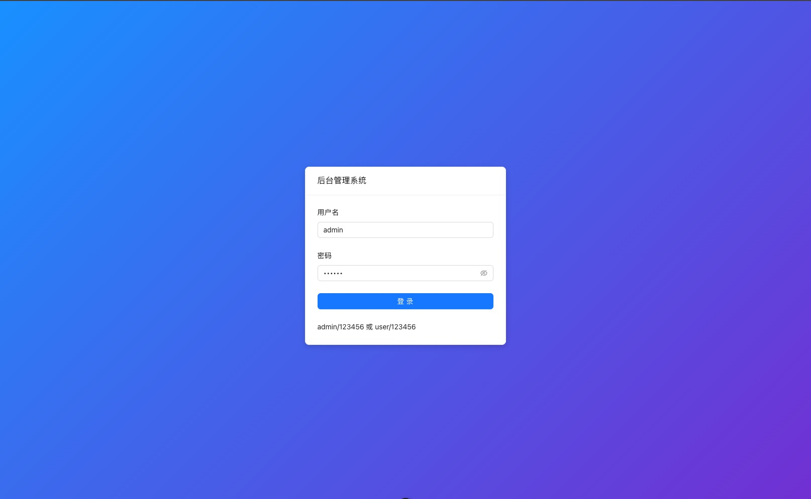
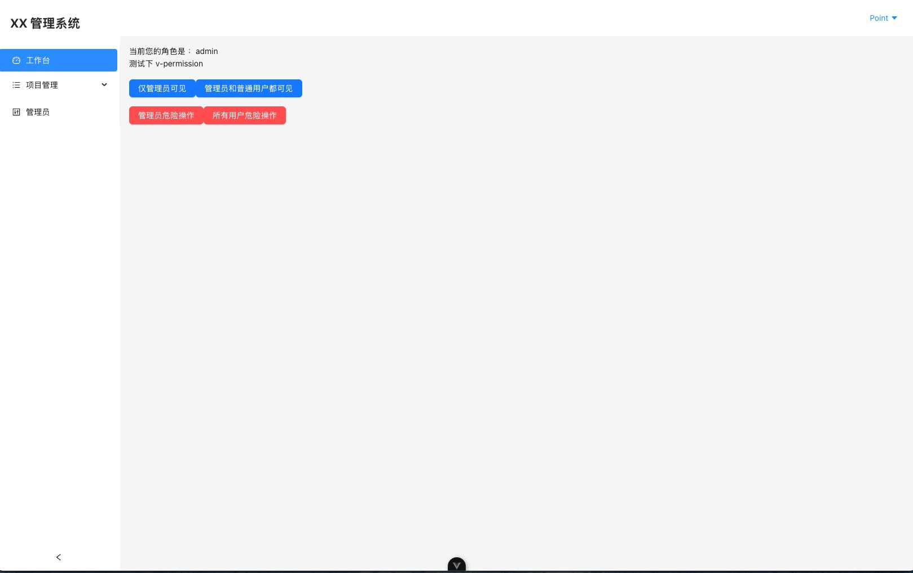

# 🧩 后台模板食用说明（极简）

欢迎使用 如果对您有帮助 给个star 🌟

现在好用的开源开箱即用的中后台模板太多了，功能都很丰富。但是有一个问题就是对于一些比较简单的后台项目，开源模板的代码显得非常的冗余，很多功能也用不到。这个版本是我从 0-1 搭建的一个很简单的模板，改动起来也很轻松（因为没写啥）

```
1、写完了基础功能 节省时间

2、代码结构清晰，完全可以直接改造

如果你只是想寻找一个写了很简单基本的功能的项目模版，那么这个项目就是最好的选择。
```

## 大概样子





## 🚀 开始

```
npm install
npm run dev

```


## 🛠 技术选型

本项目使用以下技术栈打造：

* 🚀 **Vue 3 + TypeScript**
* 🎨 **Ant Design Vue**
* 🧰 **Node 18.x**


## ✅ 已实现功能

### 🔐 登录模块

* 登录表单页
* 登录状态存储与校验
* 登录拦截（未登录跳转）

### 🧭 路由管理

* 路由动态加载（支持二级路由）
* 登录路由守卫
* 路由显隐控制（可以隐藏不想出现在侧边栏的路由）
* 403 和 404

### 🖼 布局模块

* 左侧菜单栏（可折叠）
* 顶部栏 + 页面容器
* 响应式布局，适配移动端浏览

### 🔒 权限

* 权限管理（基于角色控制路由）
* 权限管理（基于角色控制按钮等组件）


## 🧾 TODO（接下来可能会加）

* 多主题切换（黑暗模式/亮色模式）
* 富文本编辑器


## 👩‍🔧 链接

https://cn.vuejs.org/guide/introduction.html

https://antdv.com/components/overview-cn